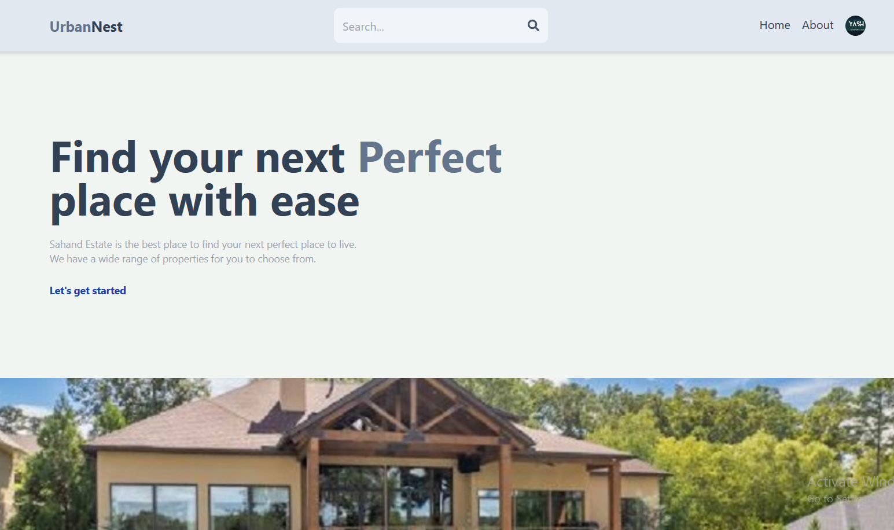
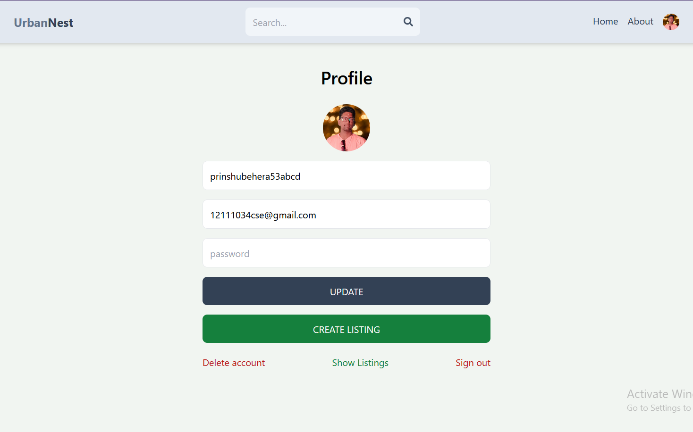

# UrbanNest - Real Estate Application   
UrbanNest is real estate application build with the power of MERN Stack.





## Installation Guide

### Requirements
- [Nodejs](https://nodejs.org/en/download)
- [Mongodb](https://www.mongodb.com/docs/manual/administration/install-community/)

Both should be installed.

```shell
git clone https://github.com/prinshukumar22/UrbanNest
cd UrbanNest
```

Now install the dependencies
```shell
npm install
cd frontend
npm install
```
We are almost done, Now just start the development server.

For Frontend.
```shell
cd frontend
npm run dev
```
For Backend.

Open another terminal in folder, Also make sure mongodb is running in background.
```shell
cd backend
npm start
```

Done! Now open localhost:5173 in your browser.
